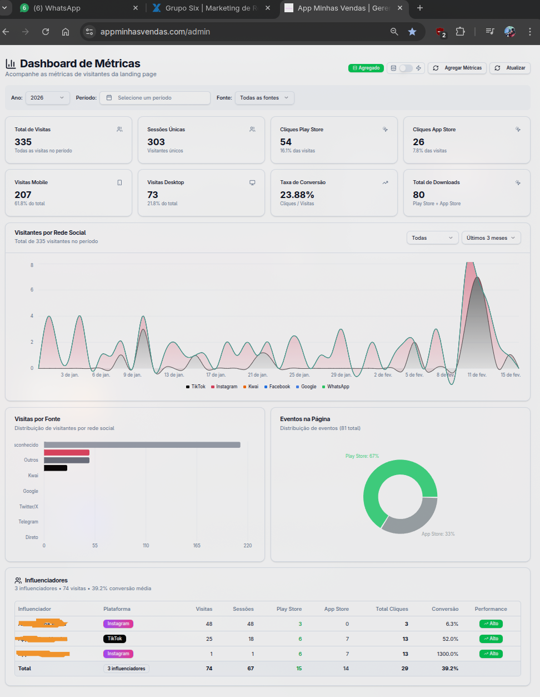
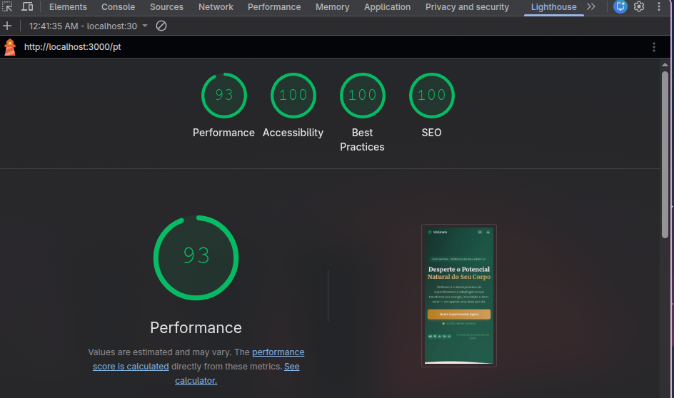
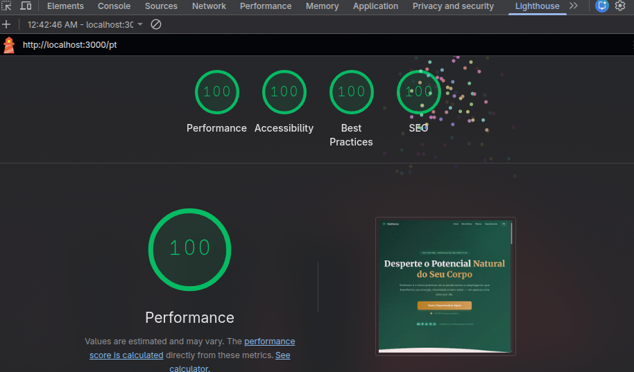

# Teste Front-end Grupo Six

`CÓDIGO PARA RODAR A APLICAÇÃO ESTÁ NO FINAL DO ARQUIVO`

# Descrição

## UTMs

Já cheguei a implementar UTMs em aplicações anteriores, inclusive no meu aplicativo App Minhas Vendas (projeto pessoal). Trabalhava com campanha de influenciadores, número de visualizações de downloads nas lojas (Google Play e App Store). Cheguei a implementar cron jobs para rodar a cada período determinado para coletar todos os dados do dia ou semana e agrupar em uma tabela para facilitar o carregamento dos dados para análises. Usava uma instância somente leitura do PostgreSQL para não impactar na performance da aplicação principal.

---

<details>

<summary>📷 Clique aqui para ver a imagem do dashboard UTM</summary>

<br>



</details>

---

No projeto, implementei UTMs usando somente o contexto e sessões que já suprem para os testes locais, mas para produção eu recomendaria o uso de ferramentas profissionais junto a UTMs para uma análise mais completa e precisa.

## VSL (Video Sales Letter)

Usei `<link rel="preconnect" href="" />` para pré-carregar, assim melhorando o SEO da página e a experiência do usuário. Primeiro mostro uma thumbnail do vídeo e, quando o usuário clica no play, eu carrego o vídeo; isso melhora o carregamento da página e a experiência do usuário.

## SEO

No SEO, implementei as técnicas básicas para um bom SEO; também aproveitei muito do Next.js, que é perfeito para ter um SEO otimizado. Carreguei alguns componentes com dynamic import para melhorar o carregamento da página e a experiência do usuário.

<details>

<summary>📷 Clique aqui para ver a imagem Lighthouse Mobile</summary>

<br>



</details>

---

<details>

<summary>📷 Clique aqui para ver a imagem Lighthouse Desktop</summary>

<br>



</details>

## Internacionalização

Como foi mencionado na entrevista, a empresa atua mais no mercado dos Estados Unidos, por isso implementei a internacionalização com suporte aos idiomas inglês e português, mas com foco no mercado dos Estados Unidos. Usei a própria biblioteca do Next.js para isso.

### Requisitos Técnicos

- **Framework:** Optei por Next.js 16 ✅
- **Estilização:** Tailwind CSS ✅
- **Deploy:** Vercel ✅
- **Performance:** Lighthouse ✅

## Funcionalidades Essenciais

### 1. Gerenciamento de UTMs

- Captura e preservação de parâmetros UTM ✅
- Repasse de UTMs para páginas subsequentes ✅

### 2. Responsividade

- Otimização de imagens e vídeo ✅
- Score mínimo de 80 no Lighthouse para:
  - Performance ✅
  - Acessibilidade ✅
  - Boas Práticas ✅
  - SEO ✅

# Como rodar a aplicação

```bash
# Em TEST-LINKS.md estão os links de testes.
```

```bash
# Rode para criar as variaveis de ambiente
echo "NEXT_PUBLIC_BASE_URL=http://localhost:3000" > .env

# Rode somente para desenvolvimento
pnpm dev

# Rode para produção - principalmente para testar SEO e performance, pois o Next.js tem vários métodos de otimização e compilação.
pnpm build
pnpm start
```
